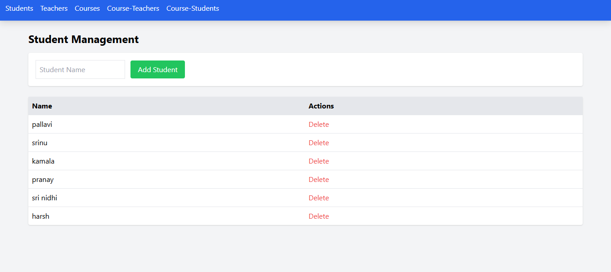
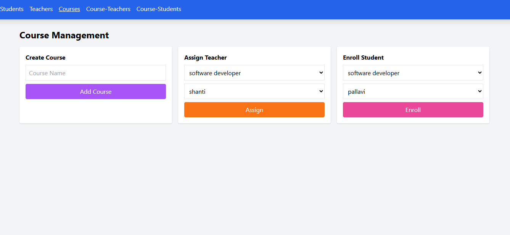
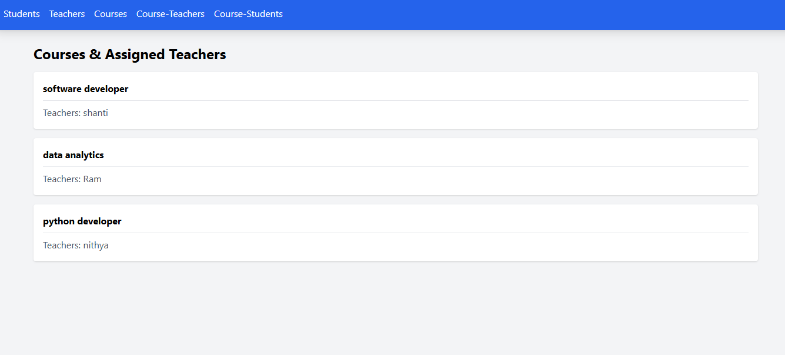

## Student-Teacher-Course Management System

This project is a professional management module developed for Bytelogik. It is built using the MERN Stack to demonstrate advanced full-stack capabilities, responsive UI design, and complex relational data modeling.

🛠️ Tech Stack
Frontend: React.js (Hooks & State Management)

Styling: Tailwind CSS (Responsive Design)

Backend: Node.js & Express.js

Database: MongoDB via Mongoose (Relational Modeling)

Database & Relational Logic
Unlike simple flat data, this version uses Mongoose Object IDs to create real relationships between entities:

Students: Independent entity.

Teachers: Independent entity.

Courses: A relational bridge that links a Teacher ID and an array of Student IDs to a specific course title.

Screenshots:

Installation & Setup
To run this project locally:

1.Clone the repository:
  git clone https://github.com/pallavi-arva/pallavi-arva-student-teacher-management.git

2.Setup Backend:

  cd backend
  
  npm install
  
  npm start
  
3.Setup Frontend:

 cd client
 
 npm install
 
 npm start
